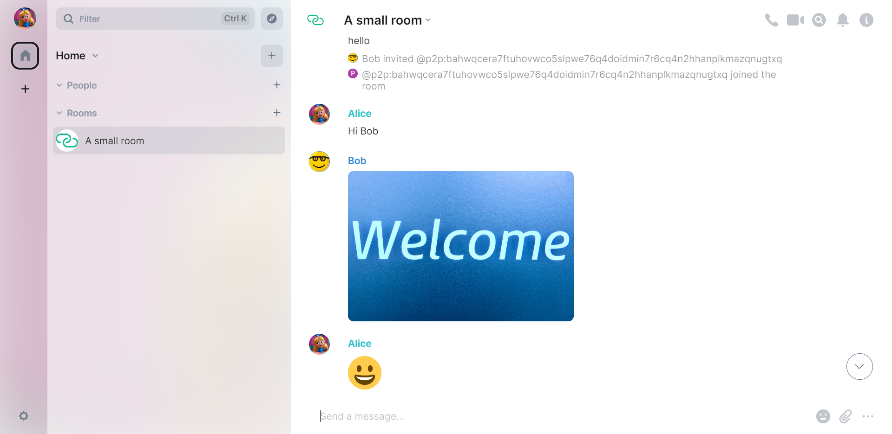
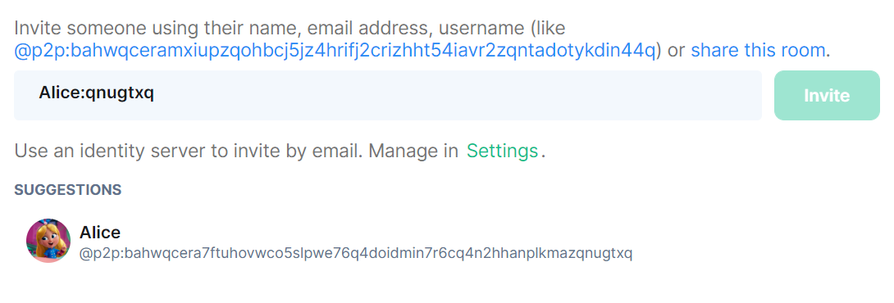

# MessageHub

A P2P [Matrix](https://matrix.org) home server created using [libp2p](https://libp2p.io/).

It runs locally on your device, finds other nodes through MDNS/DHT, and sends/receives messages in a gossip manner. No domain name is required/involved.

:construction: Alpha software warning. :construction:



# Quick Start
:point_right:[Windows Build](#windows-build)
```
docker compose run
```
Browse http://127.84.48.1

The default configuration fetches the official [Element](https://element.io/) Matrix client with custom config and serves it along with the home server. You could use other clients with home server URL http://127.84.48.2.

Currently the home server will create and save an identity (Ed25519 key) locally on first login. The user ID resembles the format of a Matrix user ID (@user_id:matrix.org). Example: 
```
@p2p:bahwqcerawciaks5d2ox7bqfpmq7zjxfcgu2nrytapoklc3vs6vni6iwqjdna
```

The server name part is the public key encoded in a libp2p CID (Content IDentifier) format.

After login, the server will advertise a few rendezvous points base on the encoded public key. Example:
- `p2p:bahwqcerawciaks5d2ox7bqfpmq7zjxfcgu2nrytapoklc3vs6vni6iwqjdna`
- `<Display Name>:iwqjdna`
- `<Display Name>:6iwqjdna`
- `<Display Name>:i6iwqjdna`
- `<Display Name>:ni6iwqjdna`

where `<Display Name>` defaults to `p2p`.

Users can update the display name, and search/invite each other using these rendezvous strings in a Matrix client:



Alternatively, users can be reached by searching the P2P `multiaddress`. Example:
```
/p2p/QmeJDzBdjVD6TfEWqDtztp7oy9VbEwAijU2bBWk2T8UxLg
```
This is the p2p address of the underlying `libp2p` node and will change each time the server is restarted.

# Build
(export DOCKER_BUILDKIT=1)
```
docker compose build
```

# How it works
The home server implements (currently a very limited portion of) the Client-Server API according to the [Matrix specification](https://spec.matrix.org/). However, it makes some important tweaks in the federation side (Server-Server API) so that
- It does not require domain name and HTTPS to establish trust.
- Nodes do not need to have direct connections to all other nodes it shares a room with.

## 1. Sign the verify keys
According to the specification, Matrix home servers exchange `server_keys` containing `verify keys` used to sign their messages, but the `server_keys` are signed using the `verify keys` themselves. One can only ensure the genuineness of `verify keys` by making a direct HTTPS request to the home server.

Now that the P2P server identity is a asymmetric crypto public key, it can sign the `verify keys`. Any other node can fetch these keys from any source and verify the signature locally.

## 2. Include server keys in messages
The room message structure, called **Persistent Data Unit** in the specification, contains a signature signed using the home server `verify key`. A `server_keys` field is added to the structure so that the data unit is **self-authenticating**, meaning its origin and validity can be verified without consulting other data source.

## 3. Include server keys in signed requests
Although the federation logic could be implemented in totally different ways, currently the home server follows the Server-Server API specification as much as possible. Like **Persistent Data Unit**, including a `server_keys` field makes a signed web request **self-authenticating**. A signed web request can be relayed among nodes sharing the same room, without worrying the content being tampered.

## 4. Sign the libp2p PeerId
The PeerId of a libp2p node is also a public key encoded in CID (Content IDentifier) format. By including and signing the libp2p PeerId in `server_keys`, it means the corresponding libp2p node is the authorized transport for the home server. Nodes can ensure they are talking to an authorized libp2p node because libp2p nodes will validate each other's PeerId.

## 5. Exchange messages using Gossipsub
Nodes publish messages using the libp2p gossipsub API, so that messages can reach every node in the room without requiring a full-mesh network structure. Nodes verify room membership of its directly connected nodes by checking if they can return a valid `server_keys` response originated from their claimed identity, and with their PeerIds signed.

# Notes
- This project is more of a proof of concept, try/use with caution.
- Nodes without dialable public IP address is configured to perform hole punching with the help of other nodes found in the DHT, but it could fail for certain kind of NAT environments. Static relays can be specified in [`config.json`](#configuration).
- Certain kinds of requests still requires direct connection, e.g., invites and media downloads.
- Client side end to end encryption support is not implemented, but communication between libp2p nodes are encrypted (the server also lives in client side :tada:). E2EE support might be of more importance, if more fancy gossip-like communication patterns are to be implemented, say hosting media files in IPFS.
- No ACL feature is implemented. Besides possible bugs/mistakes in the implementation of security features, nodes are potentially vulnerable to spamming attacks (like Matrix, but more vulnerable).
- Public room discovery is not implemented, and all rooms are effectively invite-only.

# Configuration
The list of configurable options are specified in the `config.json` file:
- **`listenAddress`**: The binding address:port pair of the home server, defaults to `127.84.48.2:80`.
- **`element.listenAddress`**: The binding address:port pair of the Element server, defaults to `127.84.48.1:80`. If set to null, the Element server will not start.
- **`libp2p.staticRelays`**: A list of static relay nodes in libp2p multiaddress format.
- **`libp2p.privateNetworkSecret`**: A pre-shared secret string for libp2p nodes. With a non-empty secret, the libp2p node can only talk to other nodes with the same secret string specified. Enabling this option will also restrict the communication to only consider private address peers.
- **`libp2p.dht.bootstrapPeers`**: A list of DHT bootstrap nodes in libp2p multiaddress format. If null (default), the list of built-in bootstrap nodes will be used.

# Windows Build
Localhost in WSL2 does not work as one might have expected, it is necessary to copy the executables out from the container and run directly in Windows. Better yet, this produces a desktop app which serves the Element client and MessageHub at the same time.

## Build
Requires WSL2, Docker and .NET Core:
```
dotnet run --project ./Automation/WindowsBuild/WindowsBuild.csproj
```
Output is generated in Build/MessageHub.
